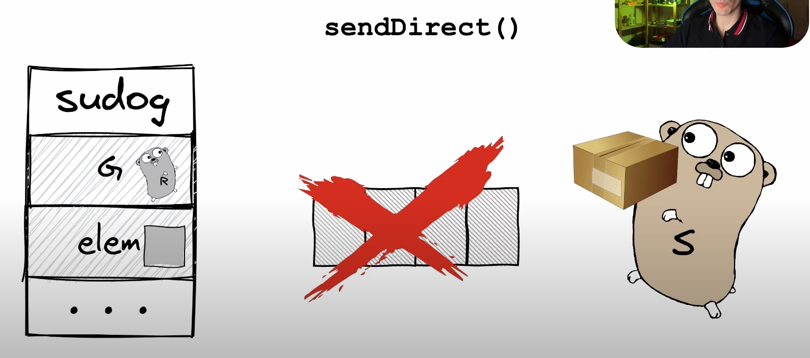

Свойстава каналов

- потокобезопасность (goroutine-safe) - с одним каналом может работать несколько горутин 
и пользователя не нужно переживать что несколько из них полчат доступы к каналу
- канал может хранить элементы и реализует симантику FIFO
- передают данные между горутинами
- умеют блокировать горутину - горутина будет временно заблокированна, до тех пор пока другая горутина не запишет в канал 


Важно понимать про облпсти памяти в Go (heap and stack) 
- https://medium.com/eureka-engineering/understanding-allocations-in-go-stack-heap-memory-9a2631b5035d


Устройство канала:


- qcount - колличество элементов которых хранится в буфере
- dataqsiz - размерность буфера
- buf - ссылка на буфер
- closed - флаг который говорит о том закрыт ли канал почему то uint32 (из за Атомиков?)
- elemsize
- elemtype
- recvq, sendq- указатель на связанный список из горутин которые ожидают чтение или записи
- recvx, sendx - номера ячеек буфера из которых будет происходить чтение или запись данных
- lock - mutex
```golang
# go\src\runtime\chan.go
type hchan struct {
    qcount   uint           // total data in the queue
    dataqsiz uint           // size of the circular queue
    buf      unsafe.Pointer // points to an array of dataqsiz elements
    elemsize uint16
    closed   uint32
    elemtype *_type // element type
    sendx    uint   // send index
    recvx    uint   // receive index
    recvq    waitq  // list of recv waiters
    sendq    waitq  // list of send waiters
    
        // lock protects all fields in hchan, as well as several
        // fields in sudogs blocked on this channel.
        //
        // Do not change another G's status while holding this lock
        // (in particular, do not ready a G), as this can deadlock
        // with stack shrinking.
        lock mutex
}
```

Как работает буффер в канале


В основе всего лежит Цикличная очередь (Circle Queue)

 - sendx - указывает на ячейку в которую будет записывать при записи индекс увеличивается на 1
 - recvx - указывает на ячейку от куда должен прочитать канал при чтении индекс сдвигается на 1


Запись в канал
 - В канал всегда ложется копия объекта, и сендер и ресивер могут спокойно изменять объект
Процесс записи: 
 - Заблочил mutex
 - Скопировал данные в яцейку буфера
 - Разблокировал mutex
 - При переполнении (когда все ячейки заняты) Сендер блокируется


 - Получатель заблокирует  mutex
 - Прочитает ячейку
 - Разблоктрует mutex

Пауза
Нужно разобраться как устроин планировщик в Go, OS Thread, goroutine, runqueue
- https://habr.com/ru/articles/478168/

 - Функция которая отвечает за отправку данных в канал, вызовет функцию gopark()
 - gopark() - на прямую обращается к планировщику который изменяет состояние 
горутины из running в waiting, затем разрывает связь горутины с Тредом, который становится 
свободным и идет дальше выполнять задачи

Как разбудить горутину


- Помио вызова функции gopack() горутина добавляется в список sendq
- sendq - это связанный список waita 
- каждый элемент waita - это sudog
- sudog - это структура, ключево параметр это 
G - наша горутина и elem -  элемент который она хочет положить в кангал

В целях оптимизации (не нужно повторно блокировать канал) Ресивер занимается пробуждение Сендера через вызов функции goready() после чего
горутина попадает в очередь runq - и будет там пока не прийдет планирощик и не начнет её выполнять



Оптимизация (не нужно 2 раза копировать данные)- Если у канала уже была горутина на которая хочет прочитать и находится в спячке.
Сендер передает данные на прямую в горутину функцией sendDirect()
одна гортина получает доступ к стеку другой горутины

Не буферезированные каналы

У них нет буффера. Одна горутина всегда передает данные другой горутине на прямую


Функции которые необходимо разобрать!

Запись и чтение из нулевого канала блокирует горутину на всегда, это происходит в функции chanrecv()
```golang
	if c == nil {
		if !block {
			return
		}
		gopark(nil, nil, waitReasonChanReceiveNilChan, traceEvGoStop, 2)
		throw("unreachable")
	}
```


Прочитать про пакет atomic

Select
go\src\runtime\select.go


 - В конструкции select происходит случайная сортировка кейсов
 - chanrecv - вызывается с параметром block = false
- без дефолта, блокирующтй селект
- с дефолтом блокирующий
Каждый кейс представлен стурктурой scase
```golang
// Select case descriptor.
// Known to compiler.
// Changes here must also be made in src/cmd/compile/internal/walk/select.go's scasetype.
type scase struct {
    c    *hchan         // chan
    elem unsafe.Pointer // data element
}
```

разобоать функцию selectgo()

Close 


разобрать функцию closechan()