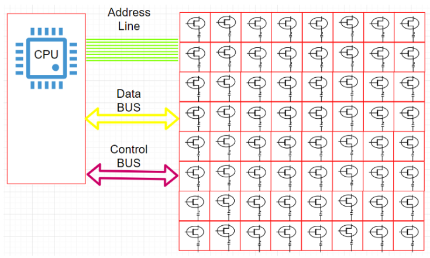
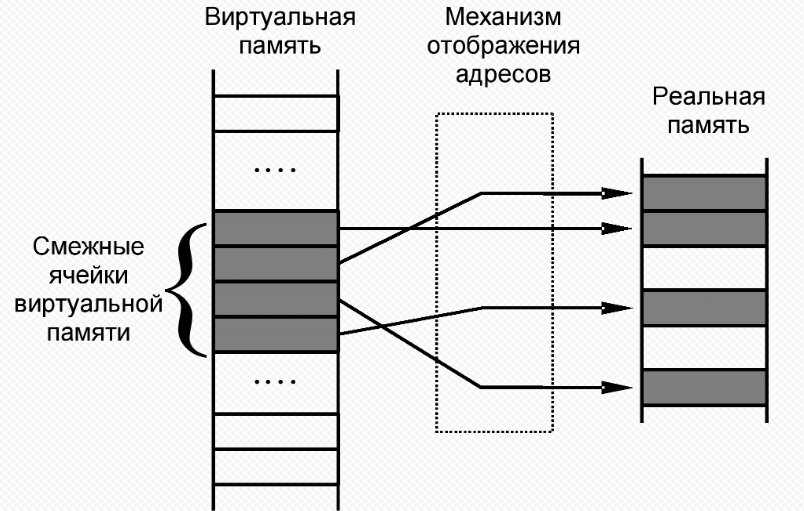
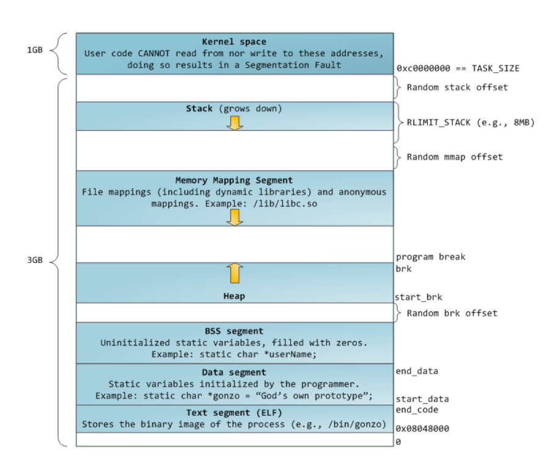
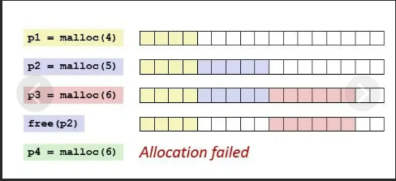

## Go memory model

### Как общаются процессор и память?

**Address line** - отвечает за адресацию до каждого байта. размерность 2^32(64 x86-64 :D на деле 2^42-2^48).

### Виртуальная память

Виртуальная память - концепция позволяющая, абстрагироваться от всей иерархии памяти машины и взаимодействовать с ней прозрачно. Реализация имеет как программную, так и аппаратную поддержку.
- Расширение "физической памяти".
- Изолированные адресные пространства для процессов.
- Задание различных свойств для разных участков памяти.

С помощью таблицы преобразования физические адреса преобразуются в виртуальные(логического адреса в линейный адрес).

Страница(сегмент) - наименьшая единица управления виртуальной памятью ~4кб(конфигурируемый).

### Память процесса

**Процесс** - образ исполнения программы ©Иртегов.

Представление процесса:
- образ исполняемого машинног кода.
- память 
    - Stack.
    - input/output data.
    - Heap.
    - etc
- Дескрипторы ресурсов OC.
- Атрибуты безопасности(роли, права).
- Контекст:
    - Регистры проца.
    - Таблица преобразования вирт. адр в физ.

**Stack** - вызов подпрограмм с локальными переменными, выделяется автоматически.
**Mmap** - адреса для отображения файлов в память(dll, so и тд)
**Heap** - динамическая область памяти, под контролем программы.
**BSS** - неинициализированные глобальные переменные.
**Data** - инициализированные глобальные переменные.
**Text** - сегмент кода(хранятся константы).

### Внутрення и внешняя фрагментация

**Внутренняя** - когда выделяется больше памяти, чем запрашивалось, избыток памяти не используется;
**Внешняя** - свободная память в процессе выделения или освобождения разделяется на мелкие блоки и в результате не обслуживаются некоторые запросы на выделение памяти.

### TCMalloc

